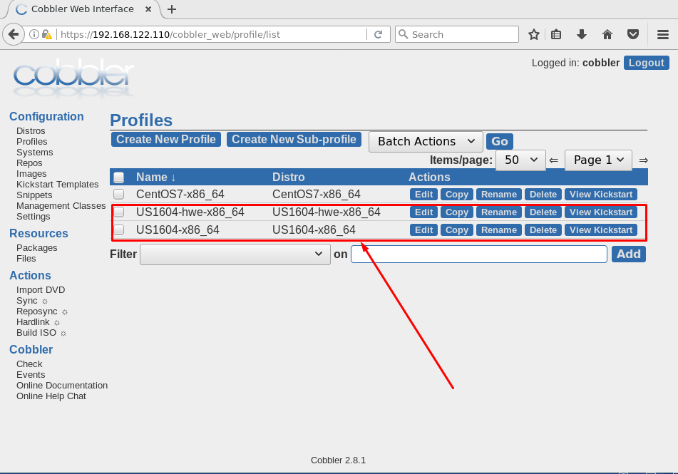

# TỔNG QUAN VỀ COBBLER

## ***Mục lục***

[1.	Giới thiệu Cobbler](#1)

[2.	Các thành phần của Cobbler](#2)

[3.	Các đối tượng trong Cobbler](#3)

[4. Tham khảo](#4)

---

Trước khi tìm hiểu Cobbler, cần nắm rõ về [PXE](../../thuctap012017/TamNT/PXE-Kickstart-Cobbler) boot trước. 

# 1.	Giới thiệu Cobbler

- **Cobbler** là một gói công cụ tiện ích cho phép triển khai hoàn chỉnh một máy chủ PXE server với khả năng cài đặt tự động các phiên bản Linux thông qua môi trường mạng đồng thời hỗ trợ kết hợp tính năng của kickstart file cho phép tự động hóa hoàn toàn quy trình cài đặt, loại bỏ hẳn các thao tác trả lời không cần thiết trong quá trình triển khai.

- Bên cạnh đó, Cobbler còn có thể giúp đỡ trong việc cung cấp, quản lý DNS và DHCP, cập nhật gói, quản lý năng lượng, sắp xếp quản lý cấu hình và nhiều tính năng nữa. 

# 2.	Các thành phần của Cobbler:

- Cobbler kết nối và tự động hóa nhiều công đoạn khác nhau trong quá trình cài đặt Linux, giúp cho người quản trị dễ dàng hơn trong việc cài đặt số lượng lớn hệ điều hành Linux với những cấu hình khác nhau. 

- Các thành phần chính của Cobbler cũng tương tự như của một PXE server bình thường: TFTP server, DHCP server, Kickstart file. Bên cạnh đó, Cobbler còn có thêm một số tính năng nổi bật như: 

	-	Web server: cung cấp giao diện web tương tác cho người quản trị, thông qua đó quản lý các profile cũng như các máy trạm được cài đặt. 

	-	DNS server: Quản lý miền dịch vụ của các máy client. (Không bắt buộc phải có như DHCP)

# 3.	Các đối tượng trong Cobbler

-	**Distro**: Đại diện cho một hệ điều hành. Nó chứa các thông tin về kernel và initrd, thêm vào đó là các dữ liệu khác như các thông số của kernel.

-	**Profile**: Chỉ tới các distro, một file kickstart, và các repository có thể, các dữ liệu khác như một vài thông số đặc biệt của kernel.

-	**System**: Đại diện cho các máy được cung cấp, nó chỉ tới một profile hoặc một image và chứa thông tin về IP và địa chỉ MAC, quản lý tài nguyên (địa chỉ, credential, type) và nhiều loại data chuyên biệt hơn.

-	**Repository**: Giữ thông tin về các mirror repo cho quá trình cài đặt và cập nhật phần mềm của các máy client.

-	**Image**: có thể thay thế cho distro cho các file mà không phù hợp với loại này. (chưa rõ lắm..)

Dựa vào các đối tượng trên và mối quan hệ giữa chúng, Cobbler biết cách làm thế nào để thay đổi hệ thống file để phản ánh cấu hình. Sau đây là mối quan hệ giữa các đối tượng trong Cobbler:

# 4. Tham khảo

[1] https://www.ibm.com/developerworks/library/l-cobbler/index.html

[2] https://letonphat.wordpress.com/2011/07/05/tri%E1%BB%83n-khai-ci-d%E1%BA%B7t-h%E1%BB%87-th%E1%BB%91ng-linux-t%E1%BB%B1-d%E1%BB%99ng-v%E1%BB%9Bi-cobbler/
