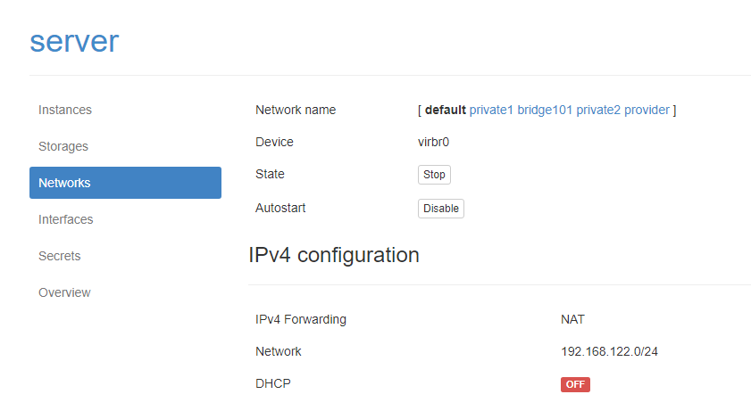

# Cài đặt Cobbler


[1.	Mô hình triển khai](#1)

[2. Các bước cài đặt và cấu hình Cobbler (manual)](#2)

- [2. 1. Bước 1: Cài đặt EPEL-repo trên Centos](#2.1)

- [2. 2. Bước 2: Cài đặt Cobbler và một số gói cần thiết](#2.2)

- [2. 3. Bước 3: Kích hoạt các dịch vụ](#2.3)

- [2. 4. Bước 4: Truy cập vào giao diện Web](#2.4)

- [2. 5. Bước 5: Cấu hình Cobbler](#2.5)


[3.	Tham khảo](#3)

---

<a name = '1'></a>
# 1.	Mô hình triển khai

- Mô hình:

	

- Chuẩn bị: bài lab thực hiện trên server đã cài đặt KVM và quản lý bởi Webvirtmgr. Trong đó:

	- **Cobbler server**: máy ảo KVM cài đặt sẵn hệ điều hành Centos 7. Có một card mạng ens3 (thuộc dải mạng default của server vật lý, có thể ra ngoài Internet) địa chỉ: 192.168.122.110/24

	- Các máy **Client 1** và **Client 2**: là các máy ảo KVM được tạo ra với một card mạng thuộc dải default-net. Chưa được cài đặt Hệ điều hành. 

	- Cấu hình trên server vật lý: Tắt DHCP của mạng default-net như sau:

		

<a name = '2'></a>
# 2.	Các bước cài đặt và cấu hình Cobbler

Thực hiện trên máy Cobbler đã cài đặt sẵn Centos 7.

<a name = '2.1'></a>
# 2.1.	Bước 1: Cài đặt EPEL-repo trên Centos

- Epel-repo (Extra Packages for Enterprise Linux) là một dự án repository từ Fedora team cung cấp rất nhiều gói add-on package mà chúng ta thường dùng cho các bản Linux bao gồm CentOS, RHEL (Red Hat Enterprise Linux) và Scientific Linux.

- Cài đặt Epel-repo thực hiện lệnh sau:

	```
	yum install epel-release
	```

<a name = '2.2'></a>
# 2.2.	Bước 2: Cài đặt Cobbler và một số gói cần thiết

```
yum install cobbler cobbler-web dnsmasq syslinux xinetd bind bind-utils dhcp debmirror pykickstart fence-agents-all -y
```

Trong đó:

\- `cobbler`, `cobbler-web`: các gói phần mềm cài đặt chạy dịch vụ cobbler và giao diện web của cobbler.

\- `dnsmasq`, `bind`, `bind-utils`, `dhcp` : các gói phần mềm chạy dịch vụ quản lý DNS và quản lý DHCP cho các máy client boot OS từ cobbler.

\- `syslinux` : là một chương trình bootloader và tiện ích cho phép đẩy vào client cho phép client boot OS qua mạng. (trong trường hợp này nó được gọi là `pxelinux`)

\- `xinetd`: chịu trách nhiệm tạo socket kết nối với máy client. Dựa vào cổng và giao thức (tcp hay udp) nó biết được phải trao đổi dữ liệu mà nó nhận được với back-end nào dựa vào thuộc tính server trong file cấu hình. Được sử dụng để quản lý và tạo socket cho TFTP server truyền file boot cho client.

\- `debmirror`: gói phần mềm cài đặt cho phép tạo một mirror server chứa các gói phần mềm cài đặt của các distro trên một server local (ở đây cài luôn lên cobbler)

\- `pykickstart` : thư việc python cho phép đọc và chỉnh sửa nội dung file kickstart, hỗ trợ cobbler chỉnh sửa file kickstart thông qua giao diện web.

\- `fence-agents-all` : *Red Hat fence agents are a collection of scripts to handle remote power management for cluster devices. They allow failed or unreachable cluster nodes to be forcibly restarted and removed from the cluster.* (tham khảo thêm [tại đây](http://cobbler.github.io/manuals/2.6.0/4/5_-_Power_Management.html).)


<a name = '2.3'></a>
# 2.3.	Bước 3: Kích hoạt các dịch vụ

-  Kích hoạt và khởi động các dịch vụ **cobblerd** và **httpd**:

	```
	systemctl start cobblerd
	systemctl enable cobblerd
	systemctl start httpd
	systemctl enable httpd
	```

-  Disable SELinux:

	-	Thực hiện các lệnh sau để disable tính năng của SELinux:

		```
		sed -i 's/\(^SELINUX=\).*/\SELINUX=disabled/' /etc/sysconfig/selinux
		sed -i 's/\(^SELINUX=\).*/\SELINUX=disabled/' /etc/selinux/config
		setenforce 0
		```

	-	Khởi động lại máy và thực hiện bước tiếp theo.

-  Thực hiện các lệnh sau nếu OS chạy firewall:

	```
	firewall-cmd --add-port=80/tcp --permanent
	firewall-cmd --add-port=443/tcp --permanent
	firewall-cmd --add-service=dhcp --permanent
	firewall-cmd --add-port=69/tcp --permanent
	firewall-cmd --add-port=69/udp --permanent
	firewall-cmd --add-port=4011/udp --permanent
	firewall-cmd --reload
	```

<a name = '2.4'></a>
# 2.4.	Bước 4: Truy cập vào giao diện Web

- Sau khi hoàn thành các bước trên, truy cập vào giao diện web của Cobbler như sau (***lưu ý: sử dụng https***): 

	`https://192.168.122.110/cobbler_web/`

- Được giao diện như sau là thành công:

	

- Đăng nhập với user mặc định là **cobbler**, password là `cobbler` ta được giao diện cobbler như sau:

	

- Để thay thay đổi hoặc thêm người dùng khác cho Cobbler, ta sử dụng lệnh sau:

	```
	htdigest /etc/cobbler/users.digest "Cobbler" <user_name>
	```

	- Sau đó nhập password vào thiết lập mật khấu cho người dùng mới thêm. Sau khi thêm user mới, kiểm tra lại user mới đã có chưa trong file `/etc/cobbler/users.digest`
	
	- Khởi động lại cobbler:

		```
		systemctl restart cobblerd
		cobbler sync
		```
	
	- Đăng nhập lại bằng người dùng mới là xong.

- Như vậy là cobbler đã được cài đặt thành công, và tiếp theo là các bước cấu hình cobbler.

<a name = '2.5'></a>
# 2.5.	Bước 5: Cấu hình Cobbler

### Sửa file cấu hình Cobbler /etc/cobbler/settings

- Sử dụng `openssl` để sinh ra mật khẩu đã được mã hóa như sau:

	```
	openssl passwd -1
	Password: <enter_password_here>
	Verifying - Password: <reenter_password_here>
	$1$1unDtJqr$6THfdcVTmF58L35aigs7N/
	```
	
- Sửa file `/etc/cobbler/settings` với các thông số `default_password_crypted` với password đã được mã hóa vừa sinh ra ở trên, và cập nhật các thông số của DHCP, DNS, PXE từ 0 lên 1 như sau: 

	- Thay thế mật khẩu vừa tạo vào mật khẩu mặc định: (sửa tại dòng 101)

		```
		default_password_crypted: "$1$1unDtJqr$6THfdcVTmF58L35aigs7N/"
		```

		Đoạn password này được sử dụng để làm password mặc định cho client khi được cấu hình trong file kickstart sử dụng với tùy chọn `--iscrypted` 

		Ví dụ: 

			```
			#Root password
			rootpw --iscrypted $default_password_crypted
			```
		Khi đó, các client khi boot lên sẽ có password như đã cấu hình. Việc này nhằm mục đích tăng tính bảo mật, không cho người khác thấy rõ được password của bạn.

	- Để thực hiện boot PXE, người quản trị cần một DHCP server để cấp phát IP và chuyển hướng trực tiếp client boot tới TFTP server nơi mà nó có thể download các file boot. Cobbler có thể quản lý và thực hiện việc này, và đồng thời quản lý dịch vụ DNS (nếu có, tuy nhiên vẫn cần cấu hình) thông qua sửa đồi thông số `manage_dhcp` và `manage_dns` (cho phép dịch vụ DHCP chạy local trên máy server). Thực hiện sửa đổi bằng lệnh như sau:

		```
		sed -i 's/manage_dhcp: 0/manage_dhcp: 1/g' /etc/cobbler/settings
		sed -i 's/manage_dns: 0/manage_dns: 1/g' /etc/cobbler/settings
		```

	- Kích hoạt cho phép boot các file cấu hình cài đặt OS qua card mạng

		```
		sed -i 's/pxe_just_once: 0/pxe_just_once: 1/g' /etc/cobbler/settings
		```

	- Chỉnh sửa IP của TFTP server (`next_server`) và IP của Cobbler (`server`). Thực hiện các lệnh sau:

		```
		sed -i 's/next_server: 127.0.0.1/next_server: 192.168.122.110/g' /etc/cobbler/settings
		sed -i 's/server: 127.0.0.1/server: 192.168.122.110/g' /etc/cobbler/settings
		```

		Trong đó, `server` là địa chỉ IP của cobbler server (lưu ý: không sử dụng địa chỉ `0.0.0.0`, nên sử dụng địa chỉ IP mà bạn muốn các client sử dụng để liên lạc với cobbler server với các giao thức như http, tftp), `next_server` là địa chỉ IP của TFTP server mà các file boot (kernel, initrd) được lấy về. Thường thì sẽ thiết lập cho cùng là Cobbler server.
	
### Cập nhật file cấu hình DHCP và DNSMASQ

- Sửa file cấu hình của DHCP như sau `vi /etc/cobbler/dhcp.template`

	```
	[...]
	subnet 192.168.122.0  netmask 255.255.255.0 {
	     option routers             192.168.122.1;
	     option domain-name-servers 8.8.8.8;
	     option subnet-mask         255.255.255.0;
	     range dynamic-bootp        192.168.122.100 192.168.122.200;
	     default-lease-time         21700;
	     max-lease-time             43100;
	     next-server                $next_server;

	     class "pxeclients" {
	          match if substring (option vendor-class-identifier, 0, 9) = "PXEClient";
	          if option pxe-system-type = 00:02 {
	                  filename "ia64/elilo.efi";
	          } else if option pxe-system-type = 00:06 {
	                  filename "grub/grub-x86.efi";
	          } else if option pxe-system-type = 00:07 {
	                  filename "grub/grub-x86_64.efi";
	          } else {
	                  filename "pxelinux.0";
	          }
	     } 
	}
	```

- Cập nhật dải địa chỉ IP được cấp phát cho client trong file `/etc/cobbler/dnsmasq.template` như sau:

	```
	[...]
	dhcp-range=192.168.122.100, 192.168.122.200
	```

- Thực hiện comment `@dists` và `@arches` trong file `/etc/debmirror.conf` để hỗ trợ các distro debian: 

	

- Khởi động lại rsyncd, cobbler và xinetd, sau đố đồng bộ lại cobbler dùng các lệnh sau:

	```
	systemctl enable rsyncd.service
	systemctl restart rsyncd.service
	systemctl restart cobblerd
	systemctl restart xinetd
	systemctl enable xinetd
	systemctl restart dhcpd
	systemctl restart tftp
	cobbler get-loaders
	cobbler check
	cobbler sync
	```

Như vậy là cấu hình xong cho Cobbler. Tham khảo các ghi chép tiếp theo để sử dụng Cobbler.

<a name = '3'></a>
# 3.	Tham khảo

[1] http://cobbler.github.io/manuals/quickstart/

[2] https://www.linuxtechi.com/install-and-configure-cobbler-on-centos-7/

[3] https://letonphat.wordpress.com/2011/07/05/tri%E1%BB%83n-khai-ci-d%E1%BA%B7t-h%E1%BB%87-th%E1%BB%91ng-linux-t%E1%BB%B1-d%E1%BB%99ng-v%E1%BB%9Bi-cobbler/ 

[4] http://openskill.info/infobox.php?ID=1461


