# Sử dụng cobbler (cơ bản)

### ***Mục lục***

[1.	Một số tác dụng quản lý các thành phần của cobbler thông qua dòng lệnh](#1)

- [1.1.	Distros](#1.1)

- [1.2.	Profile](#1.2)

- [1.3.	System](#1.3)

- [1.4.	Repos](#1.4)

- [1.5.	Kickstart Template](#1.5)

- [1.6.	Snippets](#1.6)

[2.	Cobbler import](#2)

- [2.1.	Import sử dụng dòng lệnh](#2.1)

- [2.2.	Import từ giao diện web](#2.2)

[3.	Tham khảo](#3)

---

<a name = '1'></a>
# 1.	Một số tác dụng quản lý các thành phần của cobbler thông qua dòng lệnh

<a name = '1.1'></a>
## 1.1.	Distros 

- **Distro**: Thành phần đại diện cho một hệ điều hành. Nó chứa các thông tin về `kernel` và `initrd`, thêm vào đó là các dữ liệu khác như các thông số của kernel và một số tùy chọn của file cài đặt kickstart.

- Cobbler hiện hỗ trỗ rất nhiều các distro khác nhau đến từ nhiều nhà cung cấp. tuy nhiên, vì Cobbler  có nguồn gốc hỗ trợ các distro của Red Hat, nên nó hỗ trợ mạnh mẽ cho các distro của Red Hat. Với các nhà cung cấp khác, mức độ hỗ trợ  dao động từ tốt tới yêu cầu một số bước phải thực hiện thủ công để mọi thứ làm việc trơn tru. (Xem danh sách và mức độ hỗ trợ các distro của Cobbler [tại đây](http://cobbler.github.io/manuals/2.8.0/1/2_-_Distribution_Support.html).

- Bước đầu tiên khi cài đặt một system là thêm một bản ghi về thành phần distro.

- Một số câu lệnh sử dụng quản lý distro:

	- `cobbler distro add` : thêm distro  
	- `cobbler distro copy` : copy từ một distro ra một distro mới.  
	- `cobbler distro edit` : sửa thông tin distro  
	- `cobbler distro find` : tìm kiếm thông tin về distro  
	- `cobbler distro list` : liệt kê danh sách các distro  
	- `cobbler distro remove` : xóa distro nào đó khỏi hệ thống cobbler  
	- `cobbler distro rename` : đổi tên cobbler  
	- `cobbler distro report` : Hiển thị các thông tin chi tiết về distro  

- Ví dụ: Thêm distro: 

	`cobbler distro add --name=<string> --kernel=path --initrd=path [options]`

	Trong đó `--name` là tên của distro (Centos 7, Ubuntu 16.04, ...), `--kernel` là đường dẫn chỉ tới vị trí kernel, `--initrd` là đường dẫn chỉ tới vị trí của initrd.

- Một số tùy chọn tham khảo thêm tại: http://cobbler.github.io/manuals/2.8.0/3/1/1_-_Distros.html

- Để thao tác với distro trên giao diện web, truy cập vào tab Distro sẽ hiển thì giao diện như sau: 

	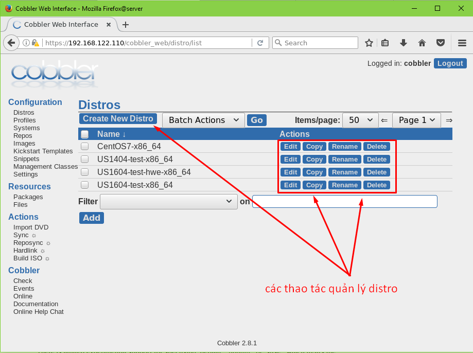

- Liệt kê các distro đang có trong hệ thống: 

	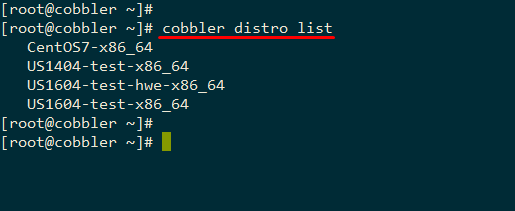

- Xem thông tin chi tiếp distro CentOS7-x86_64

	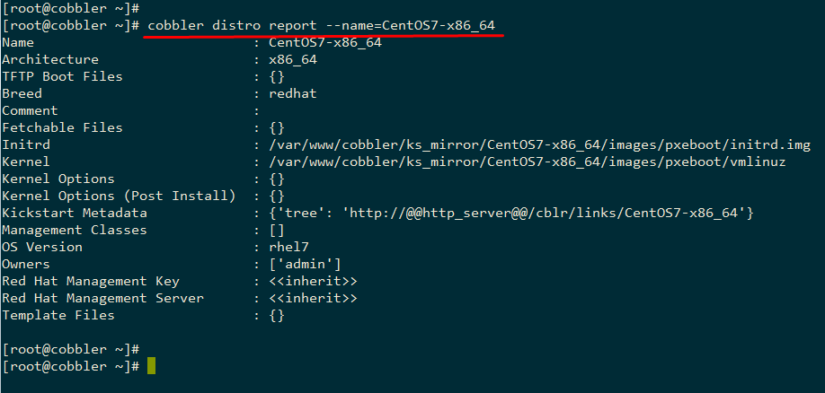

<a name = '1.2'></a>
## 1.2.	Profile

- Một profile liên kết một distro với một vài tùy chọn xác định, ví dụ như một file kickstart xác định trước. Các profile là yếu tố cốt yếu cung cấp (và phải có ít nhất một profile tồn tại trong hệ thống cobbler) để cho phép các distro được sử dụng. Một profile đại diện cho: ví dụ dùng để cài đặt một máy chủ web server, hoặc cấu hình một PC tùy ý. Bằng cách này, profile định nghĩa các quy tắc thực hiện đối với một client khi chọn profile để cài đặt.

- Các câu lệnh quản lý profile như sau:

	- `cobbler profile --help`
	- `cobbler profile add`
	- `cobbler profile copy`
	- `cobbler profile dumpvars`
	- `cobbler profile edit`
	- `cobbler profile find`
	- `cobbler profile getks`
	- `cobbler profile list`
	- `cobbler profile remove`
	- `cobbler profile rename`
	- `cobbler profile report`

- Một số tùy chọn đi liền với add và edit profile tham khảo thêm [tại đây](http://cobbler.github.io/manuals/2.8.0/3/1/2_-_Profiles_and_Sub-Profiles.html)

- Ví dụ: Liệt kê các profile hiện có trong hệ thống: 

	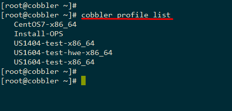

- Hoặc thao tác thông qua giao diện web: click vào tab profile trên menu: 

	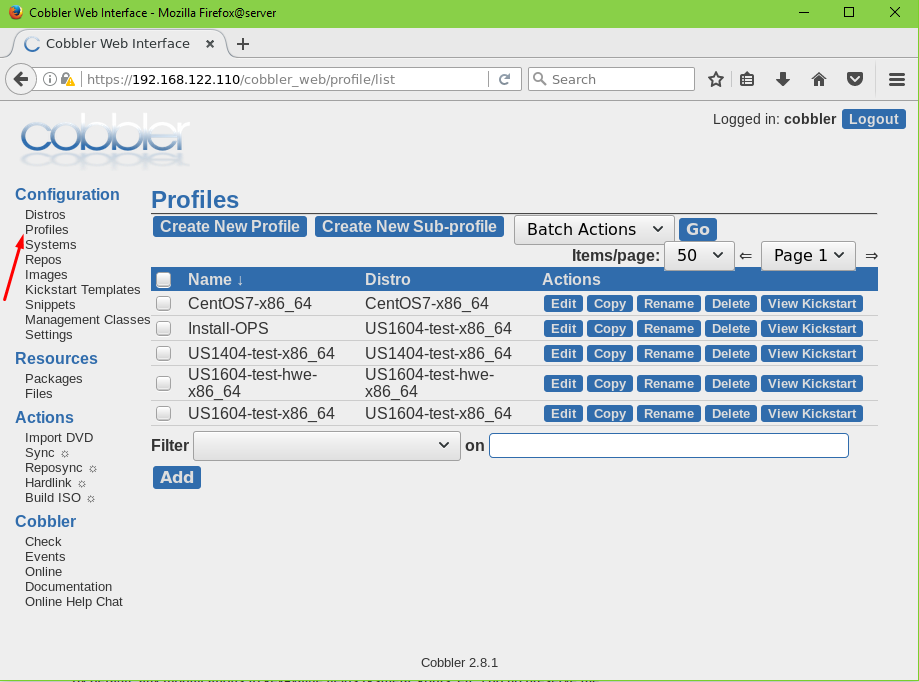

- Chọn file kickstart cho profile:

	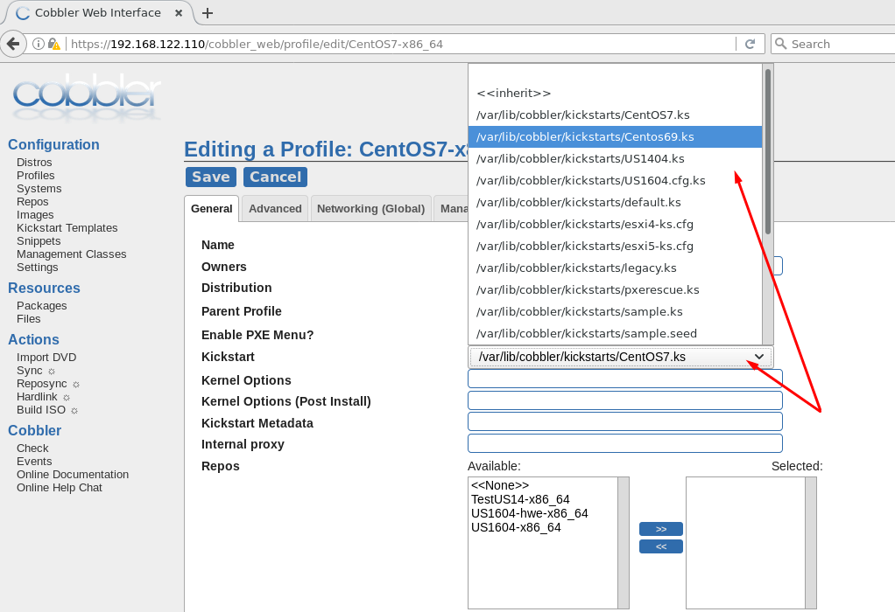

- Hiển thị thông tin cấu hình trong file kickstart của profile:

	```
	[root@cobbler ~]# cobbler profile getks --name CentOS7-x86_64
	#platform=x86, AMD64, or Intel EM64T
	#version=DEVEL
	# Firewall configuration
	firewall --disabled
	# Install OS instead of upgrade
	install
	# Use HTTP installation media
	url --url="http://192.168.122.110/cblr/links/CentOS7-x86_64/"

	# Root password
	rootpw rootpass123

	# Network information
	network --bootproto=dhcp --device=eth0 --onboot=on

	# Reboot after installation
	reboot

	# System authorization information
	auth useshadow passalgo=sha512

	# Use graphical install
	graphical

	firstboot disable

	# System keyboard
	keyboard us

	# System language
	lang en_US

	# SELinux configuration
	selinux disabled

	# Installation logging level
	logging level=info

	# System timezone
	timezone Asia/Ho_Chi_Minh

	# System bootloader configuration
	bootloader location=mbr

	clearpart --all --initlabel
	part swap --asprimary --fstype="swap" --size=1024
	part /boot --fstype xfs --size=500
	part pv.01 --size=1 --grow
	volgroup root_vg01 pv.01
	logvol / --fstype xfs --name=lv_01 --vgname=root_vg01 --size=1 --grow

	%packages
	@^minimal

	@core
	%end
	%addon com_redhat_kdump --disable --reserve-mb='auto'
	%end
	%post
	mkdir -p /root/testOS/
	%end

	[root@cobbler ~]#
	```

<a name = '1.3'></a>
## 1.3.	System 

- System  map giữa thiết bị phần cứng (hoặc một máy ảo) của client đã chọn trước với một profile để nó boot lên hệ thống tùy chỉnh. Được dùng để build lên một hệ thống cụ thể (ví dụ: client với MAC này được chọn để cài đăt là web server thì khi boot ban đầu, cobbler sẽ chạy cài đặt lên client từ OS tới các cấu hình cần thiết cho web server lên client – giống như tìm file cấu hình theo MAC trong PXE)

- Các câu lệnh với system:

	- `cobbler system add`
	- `cobbler system copy`
	- `cobbler system dumpvars`
	- `cobbler system edit`
	- `cobbler system find`
	- `cobbler system getks`
	- `cobbler system list`
	- `cobbler system poweroff`
	- `cobbler system poweron`
	- `cobbler system powerstatus`
	- `cobbler system reboot`
	- `cobbler system remove`
	- `cobbler system rename`
	- `cobbler system report`

- Các tùy chọn với lệnh quản lý system tham khảo tại đây: http://cobbler.github.io/manuals/2.8.0/3/1/3_-_Systems.html
(phần này mình chưa tìm hiểu nhiều, các bạn tự tham khảo tại trang chủ)

<a name = '1.4'></a>
## 1.4.	Repos

- Repository mirroring cho phép Cobbler sao chép lại không chỉ các gói cài đặt của distro từ @tree (Các gói phần mềm cài đặt ban đầu khi cài đặt OS, xuất hiện khi sử dụng cobbler import) mà còn các gói phần mềm tùy chọn hoặc từ các bên thứ 3, và thậm chí là các bản cập nhật của các phần mềm của OS. 

- Quản lý repos bằng dòng lệnh tham khảo tại đây: http://cobbler.github.io/manuals/2.8.0/3/1/5_-_Repos.html

- Thao tác thông qua giao diện như sau:

	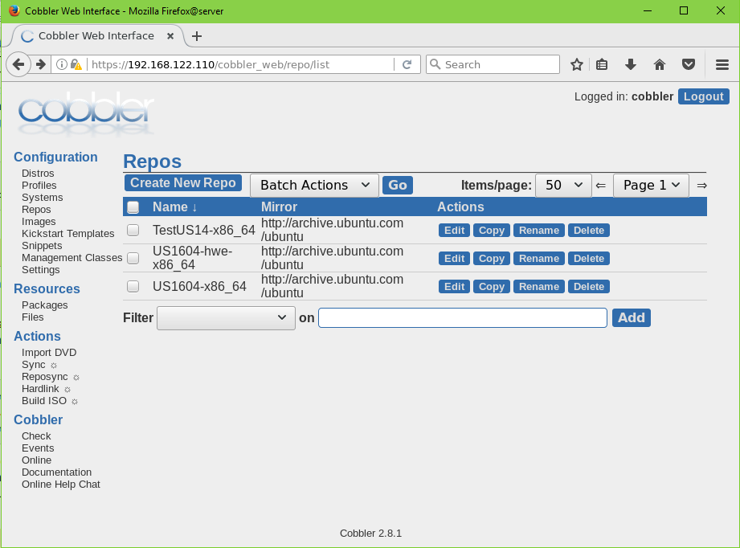

- Sửa lại thông tin repo:

	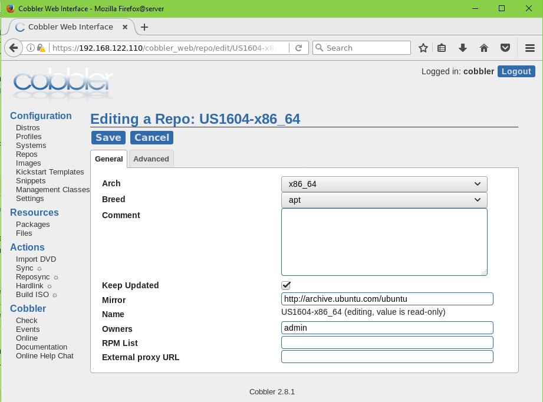

- Sau khi hoàn thiện thông tin về repos, để cập nhật các gói phần mềm từ các repo của nhà cung cấp hoặc từ các bên thứ ba, thực hiện động bộ repo với hệ thống: click vào **reposync** (khuyến cáo không nên dùng nếu cobbler server không đủ dung lượng lưu trữ tất cả các gói phần mềm từ repo chính mà định mirror).

<a name = '1.5'></a>
## 1.5.	Kickstart Template

- [**Kickstart**](https://github.com/ThanhTamPotter/thuctap012017/blob/master/TamNT/PXE-Kickstart-Cobbler/docs/1.Tong_quan_PXE-Kickstart.md#2) 

- Cobbler hỗ trợ tạo các template kickstart. Các profile của cobbler khi cần thêm tùy chọn sử dụng file kickstart với thông số `--kickstart` (nếu sử dụng dòng lệnh) hoặc thêm trực tiếp vào bởi giao diện web.

- Trong Cobbler, các file kickstart được lưu trong thư mục `/var/lib/cobbler/kickstarts`  

	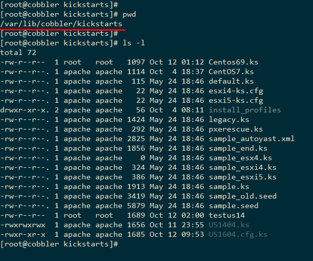

- Giao diện web cobbler hỗ trợ chỉnh sửa nội dung các file kickstart tại tab Kickstart Template:

	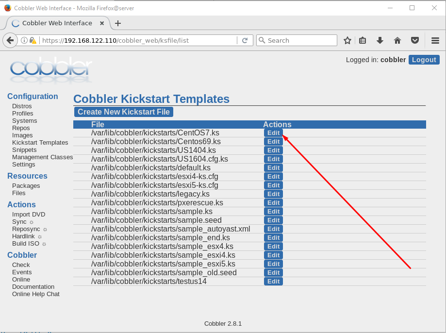

	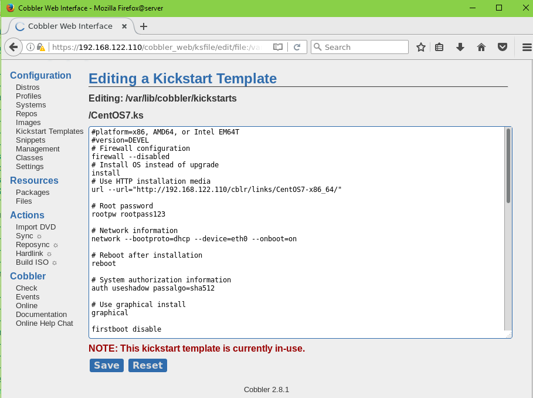

- Khi các profile lựa chọn file kickstart, cobbler sẽ sao chép file kickstart đó và tạo đường link để client có thể request thông qua http lấy thông tin file kickstart. Ví dụ: profile `CentOS7-x86_64` chọn file kickstart là `CentOS7.ks` như tùy chỉnh lúc trên, client sẽ được cobbler cho trỏ tới link sau để lấy nội dung file kickstart: `http://192.168.122.110/cblr/svc/op/ks/profile/CentOS7-x86_64` (tên file kickstart ở đường link được đặt tên theo profile):
	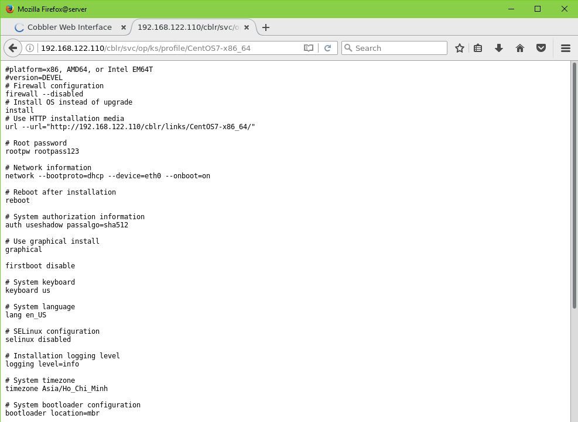

- Tìm hiểu thêm thông tin về Kickstart Template tại đây: http://cobbler.github.io/manuals/2.8.0/3/5_-_Kickstart_Templating.html

<a name = '1.6'></a>
## 1.6.	Snippets

- Snippet là một cách để tái sử dụng các dòng code chung giữa các file kickstart. Nghĩa là: việc cấu hình một số thông tin sẽ dùng chung trong file kickstart có thể được thay thế bằng các file snippet. Hiểu đơn giản như này: khi bạn muốn setup hệ thống (client) của bạn với thông tin cấu hình về network (dhcp hoặc static) thì trong mỗi file kickstart bạn phải có thông tin cấu hình cho network, giả sử như sau:

	```
	# Network information
	network --bootproto=dhcp --device=eth0 --onboot=on
	network --bootproto=dhcp --device=eth1 --onboot=on
	network --bootproto=dhcp --device=eth2 --onboot=on
	```
- Thì thay ví thế, khi sử dụng snippet, trong file kickstart khi gọi tới tên file snippet mà ta viết ra (giả sử là file `snippet_network_cfg` ) thì khi boot, client sẽ tự động cấu network giống như được nêu ra trong file `snippet_network_cfg` khi được khai báo trong file kickstart như sau: 

	`SNIPPET: snippet_network_cfg`


- Phần này tìm hiểu thêm tại: http://cobbler.github.io/manuals/2.8.0/3/6_-_Snippets.html (phần này khá là hay vì trong các file snippet có sẵn đã có một file cấu hình network tự phát hiện ra tên card mạng, nhưng do mình hiểu biết chưa kĩ nên chưa nắm rõ được phần này và sử dụng nó nên không trình bày nhiều).

- Snippet có thể quản lý thông qua giao diện web tại tab Snippets như sau:

	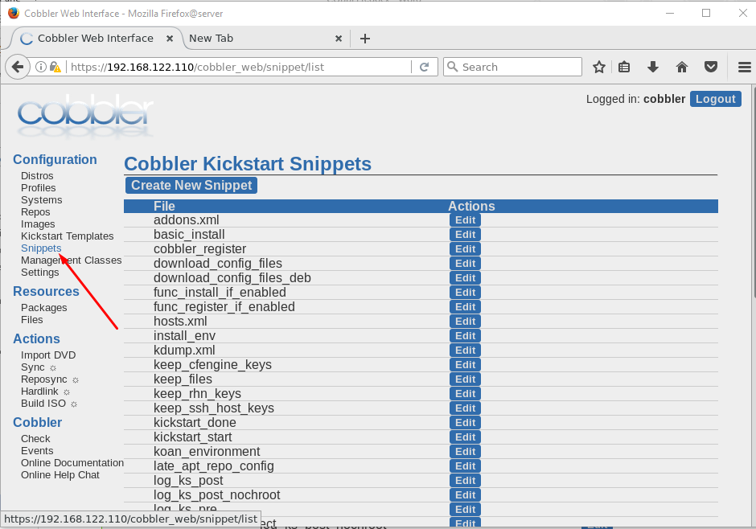

<a name = '2'></a>
# 2.	Cobbler import

- Mục đích của Cobbler import là để thiết lập một việc cài đặt server từ một hoặc nhiều distro từ các DVD image hoặc ISO file. 

- Cobbler có thể tự động thêm vào distro và profile tương ứng sử dụng distro đó khi import từ DVD image hoặc file ISO. Việc này có thể tiết kiệm thời gian hơn khi thiết lập hệ thống với việc thêm dần distro, profile, … Import là tính năng mà rất nhiều người dùng thấy được lợi ích của nó, và lại đơn giản để sử dụng. 

- Sau khi import, cobbler sẽ cố gắng phát hiện ra loại distro và tự động gán với kickstart mặc định ( `/var/lib/cobbler/kickstarts/default`) . Mặc định, nó sẽ cung cấp cho hệ thống bằng các xóa trắng ổ cứng của client, sử dụng card đầu tiên của client để dhcp, và sử dụng mật khẩu mặc định là “cobbler”. 

- Các file cài đặt cần thiết sẽ được tự động import vào thư mục `/var/www/cobbler/ks_mirror/` 


<a name = '2.1'></a>
## 2.1.	Import sử dụng dòng lệnh

- Import vào cobbler Ubuntu 16.04 từ file iso sử dụng dòng lệnh như sau: 

- Giả sử, có file iso Ubuntu 16.04 tại thư mục hiện tại, thực hiện các lệnh sau: 

	```
	mount -o loop ubuntu-16.04.4-server-amd64.iso /mnt/us1604
	cobbler import --arch=x86_64 --path=/mnt/us1604 --name=US1604
	```

- Sau khi import, ta thấy tự động distro và profile `US1604-x86_64` xuất hiện như sau:

	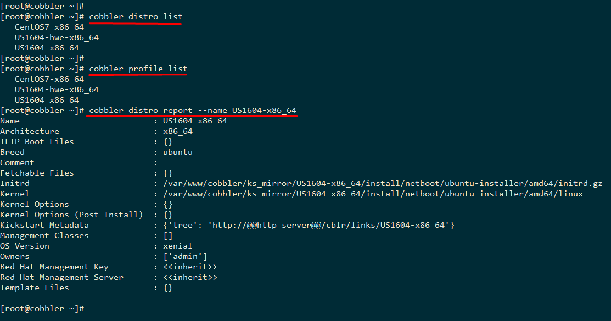

<a name = '2.2'></a>
## 2.2.	Import từ giao diện web 

- Cobbler hỗ trợ import bằng cách sử dụng giao diện web một cách nhanh chóng như sau: 

- Giả sử đã mount file iso của Ubuntu 14.04 vào thư mục `/mnt/us1404` như sau:

	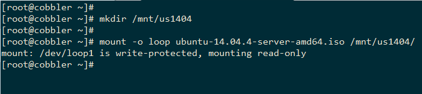

- Thực hiện trên giao diện web: 

	- Click vào tab import DVD: 

		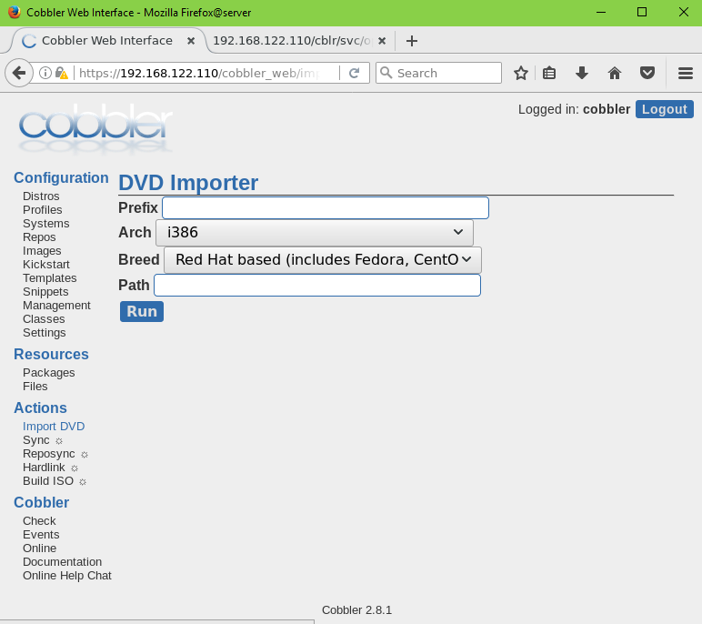

	- Điền thông tin như sau và click vào run: 

		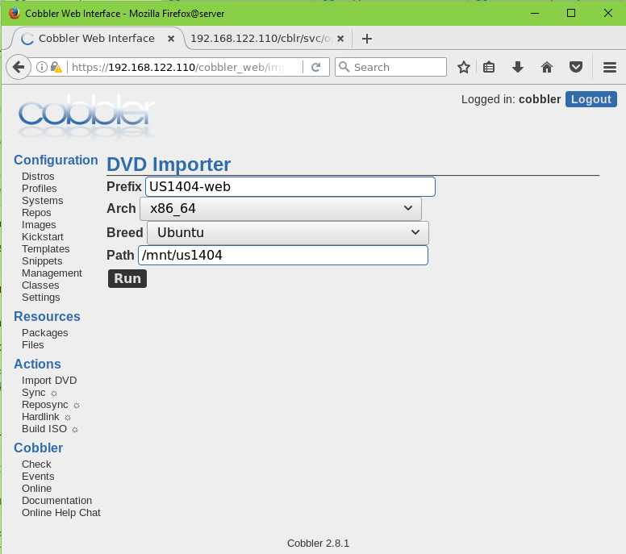


	-	Check trong tab Events ta thấy cobbler đang import như sau: 

		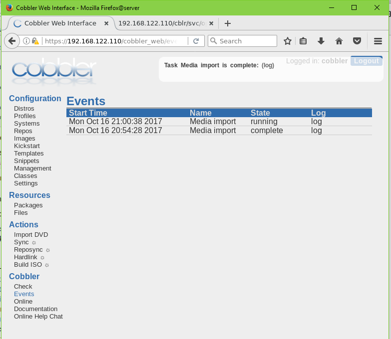

-	Sau khi import xong, check lại ta được kết quả như sau: 

	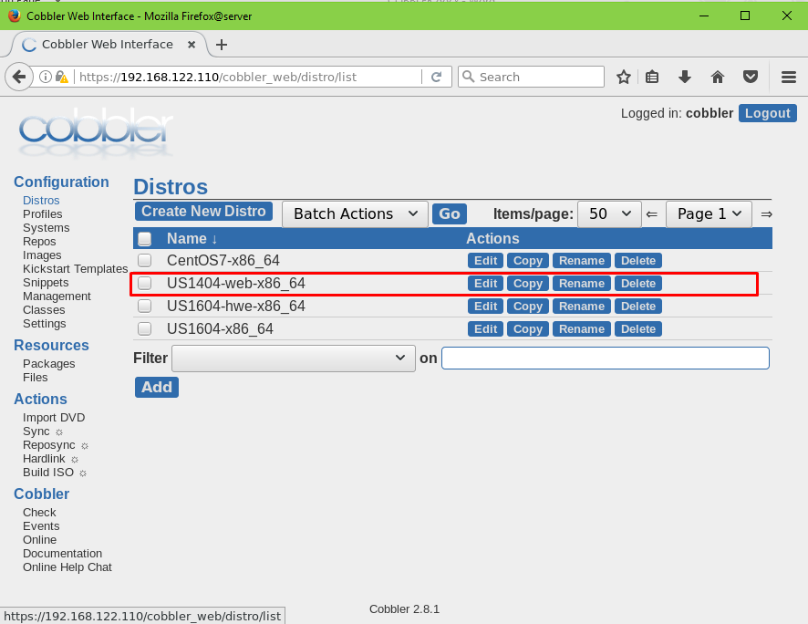

	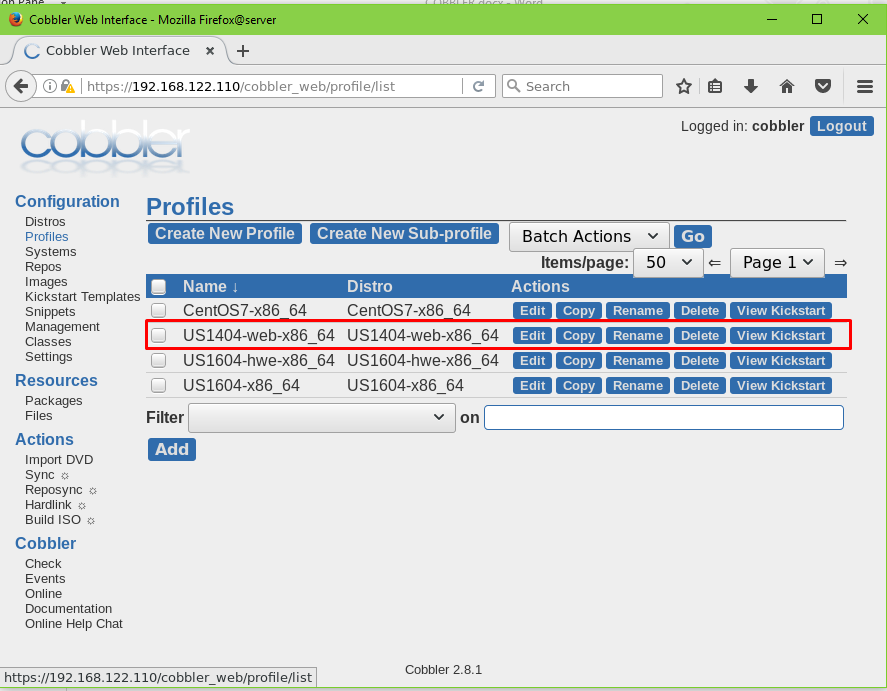

- Thực hiện tương tự với các distro và các iso khác tương ứng.

- Tham khảo thêm tại: http://cobbler.github.io/manuals/2.8.0/3/2/4_-_Import.html

<a name = '3'></a>
# 3. Tham khảo
http://cobbler.github.io/manuals/2.8.0/