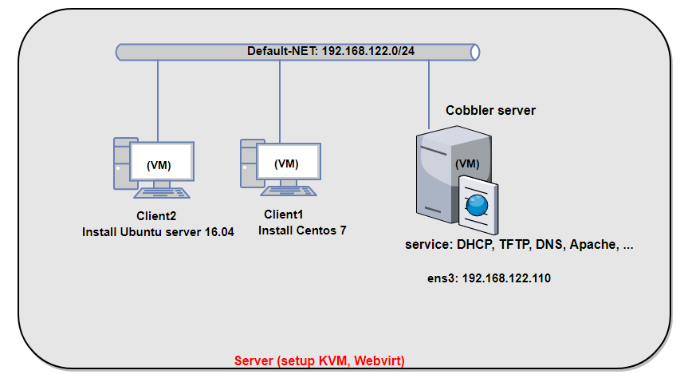

# CẤU HÌNH BUILD OS CENTOS VÀO COBBLER

### ***Mục lục***

[1.	Import Centos 7 vào Cobbler](#1)

- [1.1.	Download iso Centos 7 về Cobbler](#1.1)

- [1.2.	Mount ISO và import vào Cobbler](#1.2)

- [1.3	Xác nhận lại distro Centos 7 đã được import vào cobbler](#1.3)

[2.	Tạo file kickstart](#2)

[3.	Client boot Centos 7 từ Cobbler](#3)

[4.	Một số tùy chọn với file kickstart cho Centos 7](#4)

- [4.1.	Đổi tên card mạng về kiểu tên cũ ethX](#4.1)

- [4.2.	Client có nhiều card mạng](#4.2)

- [4.3.	Client có nhiều ổ cứng](#4.3)

[5. Tham khảo](#5)

---

Thực hiện import iso Centos vào Cobbler để các máy client có thể boot hệ điều hành Centos qua Cobbler

**Mô hình:** 



**Chuẩn bị:** bài lab thực hiện trên server đã cài đặt KVM và quản lý bởi Webvirtmgr. Trong đó:

- **Cobbler server**: máy ảo KVM cài đặt sẵn hệ điều hành Centos 7. Có một card mạng ens3 (thuộc dải mạng default của server vật lý, có thể ra ngoài Internet) địa chỉ: 192.168.122.110/24

- Các máy **Client 1** và **Client 2**: là các máy ảo KVM được tạo ra với một card mạng thuộc dải default-net. Chưa được cài đặt Hệ điều hành. 

- Cấu hình trên server vật lý: Tắt DHCP của mạng default-net như sau:

	

<a name = '1'></a>
# 1.	Import Centos 7 vào Cobbler

<a name = '1.1'></a>
## 1.1.	Download iso Centos 7 về Cobbler

- Để thực hiện download iso Centos 7 về máy Cobbler, ta có thể thực hiện theo nhiều cách khác nhau. Ở đây tôi sử dụng lệnh `wget` để download file iso Centos 7 như sau:

	```
	wget http://centos-hn.viettelidc.com.vn/7/isos/x86_64/CentOS-7-x86_64-DVD-1708.iso
	```

- Sau khi download xong, ở thư mục hiện tại có file iso Centos 7 tên: `CentOS-7-x86_64-DVD-1708.iso`

<a name = '1.2'></a>
## 1.2.	Mount ISO và import vào Cobbler

- Bây giờ khi có file iso Centos 7, ta thực hiện mount file đó vào hệ thống để Cobbler có thể copy các file boot cần thiết trong quá trình cài hệ điều hành Centos.

- Thực hiện mount file iso và import vào cobbler như sau:

	```
	mkdir  /mnt/centos
	mount -o loop CentOS-7-x86_64-DVD-1708.iso  /mnt/centos/
	cobbler import --arch=x86_64 --path=/mnt/centos --name=CentOS7
	```

- Trong quá trình import, nếu có lỗi xảy ra thì thực hiện lệnh sau:

	```
	cobbler signature update
	```
<a name = '1.3'></a>
## 1.3.	Xác nhận lại distro Centos 7 đã được import vào cobbler

- Kiểm tra trên giao diện web của Cobbler phần distro được như sau là ok:

	

- Xem thông tin chi tiết các distro: click vào các distro trên giao diện Cobbler hoặc sử dụng lệnh như sau:

	

<a name = '2'></a>
# 2.	Tạo file kickstart

- Thư mục chứa các file kickstart là `/var/lib/cobbler/kickstarts`. 

- Tạo file kickstart cho Centos 7 với tên [CentOS7_basic.ks](../tools/CentOS7_basic.ks) có nội dung như sau:

	```
	#platform=x86, AMD64, or Intel EM64T
	#version=DEVEL
	# Firewall configuration
	firewall --disabled
	# Install OS instead of upgrade
	install
	# Use HTTP installation media
	url --url="http:// $http_server/cblr/links/ /$distro_name/"

	# Set the system's root password (use $default_password that is configured in /etc/cobbler/settings)
	rootpw --iscrypted $default_password_crypted

	# Creates a new user on the system
	user ttp --fullname=ttp --password=ttppassword123

	# Network information
	network --bootproto=dhcp --device=eth0 --onboot=on

	# Reboot after installation
	reboot

	# System authorization information
	auth useshadow passalgo=sha512

	# Use graphical install
	graphical

	firstboot disable

	# System keyboard
	keyboard us

	# System language
	lang en_US

	# SELinux configuration
	selinux disabled

	# Installation logging level
	logging level=info

	# System timezone
	timezone Asia/Ho_Chi_Minh

	# System bootloader configuration
	bootloader location=mbr

	clearpart --all --initlabel
	part swap --asprimary --fstype="swap" --size=1024
	part /boot --fstype xfs --size=500
	part pv.01 --size=1 --grow
	volgroup root_vg01 pv.01
	logvol / --fstype xfs --name=lv_01 --vgname=root_vg01 --size=1 --grow

	%packages
	@^minimal

	@core
	%end
	%addon com_redhat_kdump --disable --reserve-mb='auto'
	%end
	%post
	mkdir -p /root/testOS/
	%end
	```

- Đồng bộ và cập nhật file kickstart cho profile của Centos như sau: 

	```
	cobbler profile edit --name=CentOS7-x86_64 --kickstart=/var/lib/cobbler/kickstarts/CentOS7_basic.ks
	```

	(Thao tác này có thể thực hiện bằng cách sử dụng giao diện. Xem hướng dẫn [tại đây](./5.Cobbler-Su_dung_coban.md#1.5))

<a name = '3'></a>
# 3.	Client boot Centos 7 từ Cobbler

- Chọn phần cứng cho Client 1 có một card mạng dải default_net: 192.168.122.0/24 như mô hình. Bật  Client 1 lên, sau quá trình DHCP lấy IP và boot từ Cobbler, giao diện hiển thị cho người dùng như sau: 

	

- Chọn boot Centos 7 và nhấn ENTER. Client 1 sẽ được cài hệ điều hành Centos 7, giao diện trong quá trình cài đặt như sau:

	

- Sau khi chờ OS cài đặt khoảng 10 tới 15’ là bạn đã có một máy chạy OS Centos 7 đã được cấu hình cài hệ điều hành hoàn chỉnh.

<a name = '4'></a>
# 4.	Một số tùy chọn với file kickstart cho Centos 7

<a name = '4.1'></a>
## 4.1.	Đổi tên card mạng về kiểu tên cũ ethX

- Từ bản Centos 7, tên card mạng được đặt theo tên kiểu mới `eno16777736`, … kiểu tên này vừa dài vừa gây khó nhớ cho người sử dụng. Tuy nhiên có thể tùy chỉnh để tên card mạng trở về tên theo kiểu cũ là `eth0`, `eth1`, … Thực hiện 2 bước như sau: 

	-	Thêm tùy chọn `biosdevname=0 net.ifnames=0` vào tùy chọn **kernel options** trong profile của Centos 7 trên giao diện cobbler như sau:

		

	- Trong phần cấu hình bootloader, thêm tùy chọn `--append="biosdevname=0 net.ifnames=0"` vào để kernel hiểu là vẫn dùng tên card mạng kiểu cũ. Sửa trong file kickstart (file [CentOS7_edit_ifname.ks](../tools/CentOS7_edit_ifname.ks)) tại vị trí cấu hình bootloader như sau:

		```
		bootloader --location=mbr --append="biosdevname=0 net.ifnames=0"
		```

- Sau khi boot lên OS, máy có tên các card mạng vẫn giữ định dạng cũ là `eth0`, `eth1`, …

<a name = '4.2'></a>
## 4.2.	Client có nhiều card mạng

- Nếu client có nhiều card mạng, thì việc boot từ Cobbler sẽ diễn ra bình thường, nó sẽ được boot từ card có cùng dải mạng boot với Cobbler (dải mạng dùng để boot OS qua mạng)
Có bao nhiêu card mạng thì cấu hình bấy nhiêu trong file kickstart. Ví dụ, máy có 3 card mạng và đều muốn DHCP cả 3 card đó, bạn có thể cấu hình như sau:

	```
	network --bootproto=dhcp --device=eth0 --onboot=on
	network --bootproto=dhcp --device=eth1 --onboot=on
	network --bootproto=dhcp --device=eth2 --onboot=on
	```

	(Lưu ý, trong trường hợp này đã biết tên các card mạng, nên để cho dễ quản lý, thực hiện bước trên để các card mạng để ở định dạng cũ ethX)

<a name = '4.3'></a>
## 4.3.	Client có nhiều ổ cứng

updating ...

<a name = '5'></a>
# 5. Tham khảo

[1] config file kickstart: https://access.redhat.com/documentation/en-us/red_hat_enterprise_linux/6/html/installation_guide/s1-kickstart2-options
