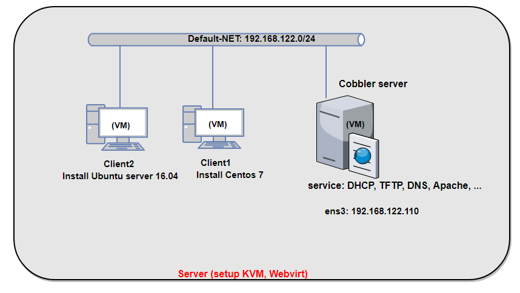
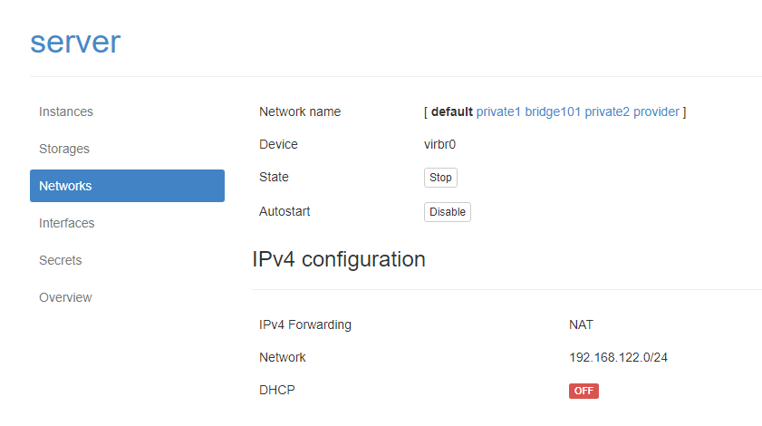
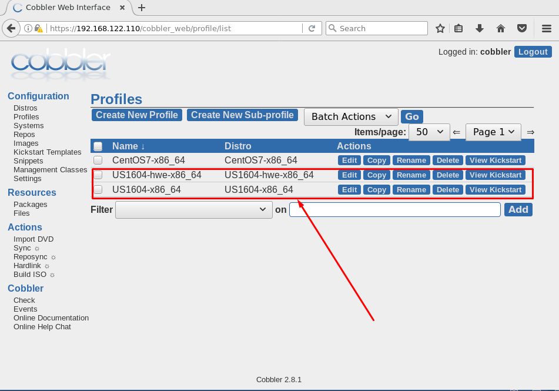
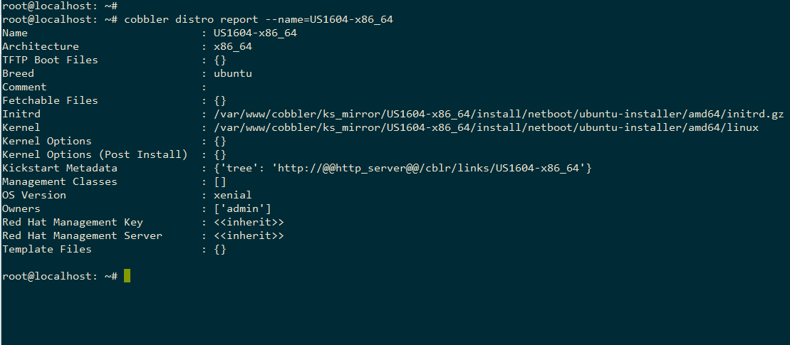
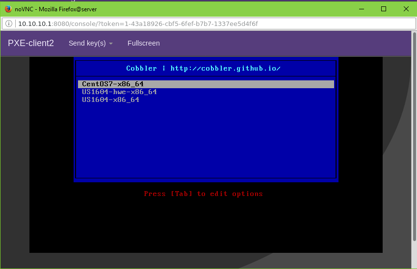
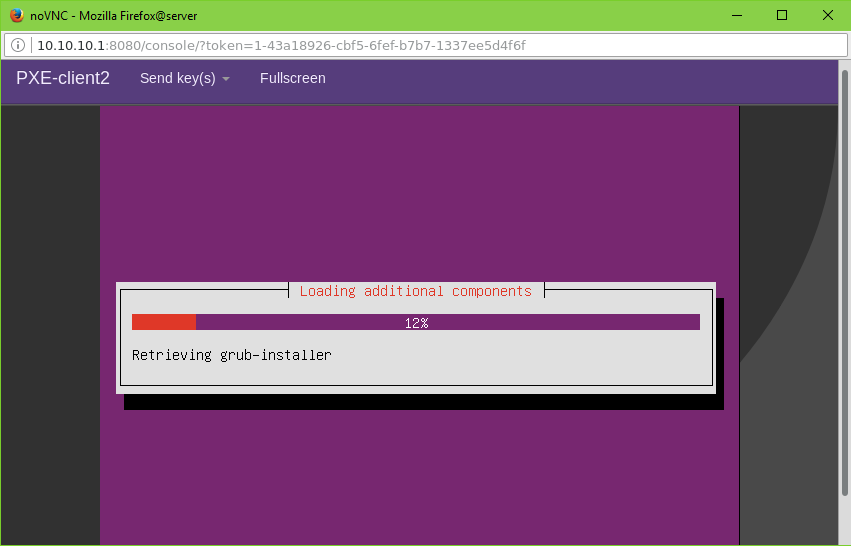
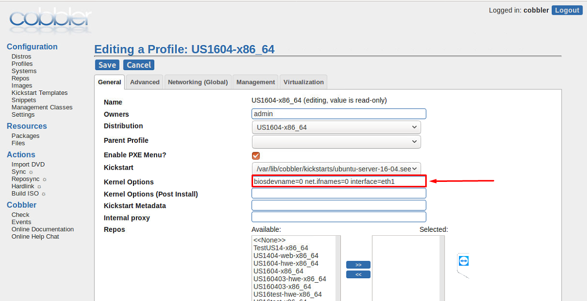

# CẤU HÌNH BUILD OS CENTOS VÀO COBBLER

### ***Mục lục***

[1.	Import Ubuntu vào Cobbler](#1)

- [1.1.	Download iso Ubuntu về Cobbler](#1.1)

- [1.2.	Mount ISO và import vào Cobbler](#1.2)

- [1.3	Xác nhận lại distro Ubuntu đã được import vào cobbler](#1.3)

[2.	Tạo file preseed cho Ubuntu](#2)

[3.	Client boot Ubuntu từ Cobbler](#3)

[4.	Một số ghi chép sử dụng distro Ubuntu](#4)

- [4.1.	Cấu hình đổi tên card mạng](#4.1)

- [4.2.	Client có nhiều card mạng](#4.2)

- [4.3.	Client có nhiều ổ cứng](#4.3)

[5. Tham khảo](#5)

---

Phần này mình thực hiện với Ubuntu server 16.04.

**Mô hình:** 



**Chuẩn bị:** bài lab thực hiện trên server đã cài đặt KVM và quản lý bởi Webvirtmgr. Trong đó:

- **Cobbler server**: máy ảo KVM cài đặt sẵn hệ điều hànhUbuntu. Có một card mạng ens3 (thuộc dải mạng default của server vật lý, có thể ra ngoài Internet) địa chỉ: 192.168.122.110/24

- Các máy **Client 1** và **Client 2**: là các máy ảo KVM được tạo ra với một card mạng thuộc dải default-net. Chưa được cài đặt Hệ điều hành. 

- Cấu hình trên server vật lý: Tắt DHCP của mạng default-net như sau:

	

<a name = '1'></a>
# 1.	Import Ubuntu vào Cobbler

<a name = '1.1'></a>
## 1.1.	Download iso Ubuntu về Cobbler

- Để thực hiện download isoUbuntu về máy Cobbler, ta có thể thực hiện theo nhiều cách khác nhau. Ở đây tôi sử dụng lệnh `wget` để download file isoUbuntu như sau:

	```
	wget http://releases.ubuntu.com/16.04.3/ubuntu-16.04.3-server-amd64.iso
	```

- Sau khi download xong, ở thư mục hiện tại có file isoUbuntu tên: `ubuntu-16.04.3-server-amd64.iso`

<a name = '1.2'></a>
## 1.2.	Mount ISO và import vào Cobbler

- Bây giờ khi có file iso Ubuntu 16.04, ta thực hiện mount file đó vào hệ thống để Cobbler có thể copy các file boot cần thiết trong quá trình cài hệ điều hành Ubuntu.

- Thực hiện mount file iso và import vào cobbler như sau:

	```
	mkdir /mnt/us16
	mount -o loop  ubuntu-16.04.3-server-amd64.iso  /mnt/us16/
	cobbler import --arch=x86_64 --path=/mnt/us16 --name=US1604
	```

- Trong quá trình import, nếu có lỗi xảy ra thì thực hiện lệnh sau:

	```
	cobbler signature update
	```
<a name = '1.3'></a>
## 1.3.	Xác nhận lại distroUbuntu đã được import vào cobbler

- Kiểm tra trên giao diện web của Cobbler phần distro được như sau là ok:

	

- Xem thông tin chi tiết các distro: click vào các distro trên giao diện Cobbler hoặc sử dụng lệnh như sau:

	

<a name = '2'></a>
# 2.	Tạo file preseed cho Ubuntu

- Thư mục chứa các file preseed là `/var/lib/cobbler/kickstarts`. 

- Tạo file kickstart cho Ubuntu 16.04 với tên [ubuntu-server-16-04.seed](../tools/ubuntu-server-16-04.seed) có nội dung như sau:

	```
	#
	# Ubuntu Server 16.04 Preseed
	#
	# Usage:
	#
	# This Ubuntu Preseed file is meant to be used with Cobbler. It has been
	# tested only on Cobbler 2.8.2. It is a completely unattended install.
	#
	# References:
	#
	# https://help.ubuntu.com/14.04/installation-guide/example-preseed.txt
	# http://www.claudiokuenzler.com/blog/513/debian-ubuntu-preseed-create-two-volume-groups-same-disk

	#############
	#
	# Kernel Options
	#
	#############

	# Use the following option to add additional boot parameters for the
	# installed system (if supported by the bootloader installer).
	# Note: options passed to the installer will be added automatically.
	d-i debian-installer/add-kernel-opts string $kernel_options

	#############
	#
	# Networking
	#
	#############

	d-i netcfg/choose_interface select auto
	d-i netcfg/get_hostname string $hostname

	#############
	#
	# Pre Install
	#
	#############

	# Command Line 1: This is necessary otherwise you will be prompted to umount /dev/sda. See Ubuntu bug #1347726.
	d-i preseed/early_command string \
		umount /media || true

	#############
	#
	# Net Image
	#
	#############

	# Required at least for 12.10+
	d-i live-installer/net-image string http://$http_server/cobbler/links/$distro_name/install/filesystem.squashfs

	#############
	#
	# Localization
	#
	#############

	d-i debian-installer/locale string en
	d-i debian-installer/country string US
	d-i debian-installer/locale string en_US.UTF-8
	d-i debian-installer/language string en

	#############
	#
	# Keyboard
	#
	#############

	# Disable automatic (interactive) keymap detection.
	d-i console-setup/ask_detect boolean false
	d-i console-setup/layoutcode string us
	d-i console-setup/variantcode string
	d-i keyboard-configuration/layoutcode string us
	d-i keyboard-configuration/variantcode string

	#############
	#
	# Mirror
	#
	#############

	d-i mirror/country string manual
	d-i mirror/http/proxy string
	d-i mirror/http/hostname string $http_server
	d-i mirror/http/directory string $install_source_directory

	# d-i mirror/protocol string http
	# d-i mirror/country string manual
	# d-i mirror/http/hostname string archive.ubuntu.com
	# d-i mirror/http/directory string /ubuntu
	# d-i mirror/http/proxy string


	# Uncomment this if you don't want to use a network mirror.
	# d-i apt-setup/use_mirror boolean true

	#############
	#
	# Clock and Time Zone
	#
	#############

	# Controls whether to use NTP to set the clock during the install
	d-i clock-setup/ntp boolean true
	d-i clock-setup/ntp-server string ntp.ubuntu.com

	# You may set this to any valid setting for $TZ; see the contents of
	# /usr/share/zoneinfo/ for valid values.
	d-i time/zone string Asia/Ho_Chi_Minh
	# Controls whether or not the hardware clock is set to UTC.
	d-i clock-setup/utc boolean true

	#############
	#
	# Partitioning
	#
	#############

	# If one of the disks that are going to be automatically partitioned
	# contains an old LVM configuration, the user will normally receive a
	# warning. This can be preseeded away...
	d-i partman-lvm/device_remove_lvm boolean true

	# The same applies to pre-existing software RAID array:
	d-i partman-md/device_remove_md boolean true

	# And the same goes for the confirmation to write the lvm partitions.
	d-i partman-lvm/confirm boolean true
	d-i partman-lvm/confirm_nooverwrite boolean true

	d-i partman-auto/method string lvm
	d-i partman-auto/disk string /dev/[sv]da

	# For LVM partitioning, you can select how much of the volume group to use
	# for logical volumes.
	d-i partman-auto-lvm/guided_size string max

	# Disk Partitioning
	# Use LVM, and wipe out anything that already exists
	d-i partman/choose_partition select finish
	d-i partman/confirm boolean true
	d-i partman/confirm_nooverwrite boolean true
	d-i partman-auto/method string lvm
	d-i partman-lvm/device_remove_lvm boolean true
	d-i partman-lvm/confirm boolean true
	d-i partman-lvm/confirm_nooverwrite boolean true
	d-i partman-md/device_remove_md boolean true
	d-i partman-partitioning/confirm_write_new_label boolean true
	d-i grub-installer/grub2_instead_of_grub_legacy boolean true
	d-i grub-installer/only_debian boolean true
	d-i grub-installer/bootdev string /dev/[sv]da
	d-i debian-installer/quiet boolean false
	d-i debian-installer/splash boolean false

	# You can choose one of the three predefined partitioning recipes:
	# - atomic: all files in one partition
	# - home:   separate /home partition
	# - multi:  separate /home, /usr, /var, and /tmp partitions
	d-i partman-auto/choose_recipe select atomic

	# If you just want to change the default filesystem from ext3 to something
	# else, you can do that without providing a full recipe.
	# d-i partman/default_filesystem string ext4

	#############
	#
	# Packages
	#
	#############

	# Package selection
	d-i pkgsel/include string openssh-server wget

	# Whether to upgrade packages after debootstrap.
	# Allowed values: none, safe-upgrade, full-upgrade
	d-i pkgsel/upgrade select none

	# Policy for applying updates. May be "none" (no automatic updates),
	# "unattended-upgrades" (install security updates automatically), or
	# "landscape" (manage system with Landscape).
	d-i pkgsel/update-policy select none

	# Some versions of the installer can report back on what software you have
	# installed, and what software you use. The default is not to report back,
	# but sending reports helps the project determine what software is most
	# popular and include it on CDs.
	popularity-contest popularity-contest/participate boolean false

	#############
	#
	# Users and Password
	#
	#############

	# Skip creation of a root account (normal user account will be able to
	# use sudo). The default is false; preseed this to true if you want to set
	# a root password.
	d-i passwd/root-login boolean true

	# Alternatively, to skip creation of a normal user account.
	d-i passwd/make-user boolean false

	# The installer will warn about weak passwords. If you are sure you know
	# what you're doing and want to override it, uncomment this.
	d-i user-setup/allow-password-weak boolean true

	# Root password, either in clear text
	d-i passwd/root-password password Welcome123
	d-i passwd/root-password-again password Welcome123

	## Or use default_password_crypted that was configed in /etc/cobbler/settings
	# d-i passwd/root-password-crypted password $default_password_crypted

	#############
	#
	# Post Install
	#
	#############
	# Command Line 1: Allow root to SSH.
	# Command Line 2,3 : Edit file sources.list 
	d-i preseed/late_command string \
	sed -i '/PermitRootLogin / s/ .*/ yes/' /target/etc/ssh/sshd_config; \
	sed -i 's/$http_server/vn.archive.ubuntu.com/g' /target/etc/apt/sources.list; \
	sed -i 's|cblr/links/$distro_name|ubuntu|g' /target/etc/apt/sources.list; \
	touch /target/root/hello_TTP
	#############
	#
	# Finish
	#
	#############

	# Reboot after the install is finished.
	finish-install finish-install/reboot_in_progress note
	```

- Đồng bộ và cập nhật file preseed cho profile của Ubuntu như sau (hoặc có thể thực hiện bằng giao diện cobbler):  

	```
	cobbler profile edit --name=US1604-x86_64 --kickstart=/var/lib/cobbler/kickstarts/ubuntu-server-16-04.seed
	cobbler sync
	```

	(Thao tác này có thể thực hiện bằng cách sử dụng giao diện. Xem hướng dẫn [tại đây](./5.Cobbler-Su_dung_coban.md#1.5))

<a name = '3'></a>
# 3.	Client bootUbuntu từ Cobbler

- Chọn phần cứng cho Client 2 có một card mạng dải default_net: 192.168.122.0/24 như mô hình. Bật  Client 2 lên, sau quá trình DHCP lấy IP và boot từ Cobbler, giao diện hiển thị cho người dùng như sau: 

	

- Chọn boot Ubuntu và nhấn ENTER. Client 2 sẽ được cài hệ điều hành Ubuntu, giao diện trong quá trình cài đặt như sau:

	

- Sau khi chờ OS cài đặt khoảng 10 tới 15’ là bạn đã có một máy chạy OS Ubuntu đã được cấu hình cài hệ điều hành hoàn chỉnh.

<a name = '4'></a>
# 4. Một số ghi chép sử dụng distro Ubuntu

<a name = '4.1'></a>
## 4.1.	Cấu hình đổi tên card mạng

- Từ phiên bản 16, Ubuntu đổi tên card mạng thành dạng ensX (với X là những số không dễ đoán trước được trên từng hệ thống). Để dễ dàng quản lý, ta có thể đổi về định dạng tên cũ ethX (với X là thứ tự card của máy). Thực hiện các bước như sau:

	-	Thêm **kernel options**: `biosdevname=0 net.ifnames=0` vào profile (sử dụng giao diện Cobbler) của Ubuntu:

		

	- Ở đây, mình chọn setup cho hệ thống client có nhiều hơn 1 card mạng, dải boot là dải thứ 2 nên chỉ định `eth1`. (nếu không có tùy chọn chỉ định `interface=eth1` thì lúc boot lên hệ thống sẽ hỏi bạn chọn card nào để cấu hình IP để lấy file preseed về)

	-	Trong file preseed không cần sửa thêm gì nữa bởi nó đã được cấu hình tại dòng 117 đã được cấu hình sử dụng các kernel options: 

		```
		d-i debian-installer/add-kernel-opts string $kernel_options
		```
	

<a name = '4.2'></a>
## 4.2.	Client có nhiều card mạng

Xử lý như phần trên. Chỉ định card mạng để hệ thống có thể cấu hình và lấy về file preseed. Vì distro là Ubuntu nên sau khi boot lên OS, chỉ có 1 card là đã được cấu hình. Tùy từng hệ thống bạn cài đặt mà tên các card có thể không thống nhất (card thứ nhất là ens3 với KVM, nhưng trên ESX là ens33) nên để dễ quản lý, bạn có thể thực hiện bước trên để đặt tên card mạng về kiểu cũ của tên card mạng (card thứ nhất là eth0, thứ hai là eth1, …)

<a name = '4.3'></a>
## 4.3.	Client có nhiều ổ cứng

updating ...

<a name = '5'></a>
# 5. Tham khảo

Config preseed: 

[1] https://www.debian.org/releases/stable/amd64/apbs04.html.en

[2] https://wiki.debian.org/DebianInstaller/Preseed
