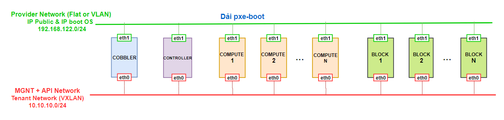
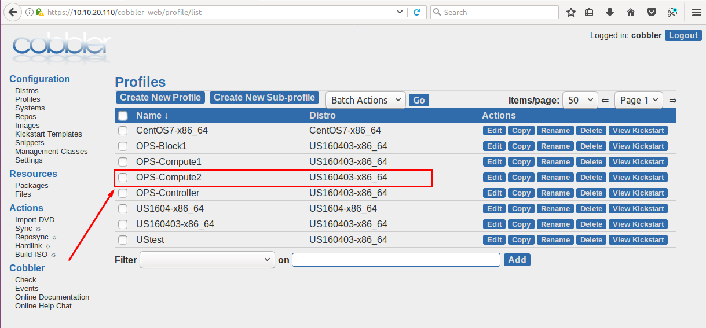

# TÍCH HỢP CÀI OPENSTACK VÀO COBBLER

<a name = '1'></a>
# 1. Mô hình



- Mô hình triển khai bài lab trên máy ảo KVM quản lý bởi Webvirtmgr. Các máy ảo dùng trong bài lab ngoại trừ Cobbler ban đầu chưa được cài đặt OS. 

- Các máy có 2 card mạng thuộc 2 dải mạng như hình. 

- Bài lab này tích hợp các script cài đặt Openstack từ link tham khảo sau: https://github.com/doxuanson/Install-OpenStack/tree/master/Pike/Linuxbridge 

<a name = '1'></a>
# 2.	Các bước cấu hình

## Bước 1: Chuẩn bị script cài đặt Openstack (Pike)

- Download thư mục chứa file scripts OPS-setup cài Openstack từ link tham khảo trên: https://github.com/doxuanson/Install-OpenStack/tree/master/Pike/Linuxbridge về. (Tải luôn thư mục OPS-setup trong mục `scripts` đã sửa lại cho giống với mô hình triển khai trong bài lab này)

- Sau khi có thư mục `OPS-setup/`, thực hiện di chuyển thư mục đó vào thư mục web root của Cobbler: 

	```
	cp -r OPS-setup/ /var/www/html/
	cd /var/www/html/
	chmod -R 755 OPS-setup/
	chmod -R apache:apache OPS-setup/
	```

## Bước 2: Cấu hình các script tạo profile tương ứng với các thành phần trong Openstack 

- Ở đây, sử dụng các script trong thư mục `kickstart_OPS/` để thiết lập tạo các profile tương ứng cài cho các node Controller, các node compute và các node Block (Cinder). 

- File `config.sh` dùng để tùy chỉnh thích hợp với nhiều mô hình mạng khác nhau (thay thế địa chỉ IP của Cobbler phù hợp với mô hình của bạn)

	```
	# Var
	COBBLER_IP=192.168.122.110
	APT_CACHE_SERVER=192.168.122.1 #Dien IP cua cache-ng neu co
	PATH_OPSsetup="OPS-setup" #Thu muc chua cac file script cai dat OPS
	ROOT_PASS=welcome123	#password mac dinh cho user root cua cac con client cai OPS
	USER_NAME=ubuntu
	USER_PASS=welcome123
	REPO_PATH=http://192.168.122.110/cblr/links/US160403-x86_64/
	com_num=1
	blk_num=1
	```

> Lưu ý: phần cấu hình `REPO_PATH`, trong bài này mình sử dụng distro tên `US160403-x86_64` (import từ iso ubuntu server 16.04.3) nên đường dẫn tới repo là tới thư mục chứa các gói cần thiết cho quá trình cài đặt OS của distro tên US160403-x86_64. Trong mô hình của bạn sẽ sửa tên distro tương ứng cho phù hợp. 

- Để tạo profile cài đặt node controller: thực hiện chạy file script `CTL_create_ks_profile.sh` (lưu ý: các file đuôi sh được set quyền 755 để thực thi được)
Để tạo profile cài đặt node compute: ta thực hiện sửa phần `com_num=n` trong file `config.sh` để tạo ra tương ứng cho node compute thứ n. 

- Tương tự tạo profile cài đặt node cinder thực hiện như trên. 

- Sau khi sửa file `config.sh`, thực hiện các lệnh sau: 

	```
	source CTL_create_ks_profile.sh
	source COM_create_ks_profile.sh
	source BLK_create_ks_profile.sh
	```

- Trên giao diện Cobbler ta có thêm 3 profile cài đặt Openstack 3 node: Controller, Compute1 và Block1 như sau: 

	

- Bật máy dùng để cài Controller lên ta thấy được giao diện như sau: 

	

- Ví dụ: Theo mặc định, như cấu hình trong file `config.sh` sau khi chạy các script tạo profile các node tương ứng lần đầu tiên ta sẽ có mô hình gồm 3 node: controller, compute 1, block 1.

- Bây giờ, để tạo cho profile cho node compute 2, ta sửa `com_num=2` trong file config.sh
Khi đó, chạy file script  `source COM_create_ks_profile.sh` để tạo profile cho node compute 2.

- Trên Cobbler đã có profile cho node compute 2 như sau:

	

- Sau khi lựa chọn cài đặt tương ứng, các máy sau khi cài OS được tích hợp script chạy cài đặt Openstack được cấu hình sẵn trong file `/etc/rc.local` đã sửa trong phần %post trong các file kickstart. 

