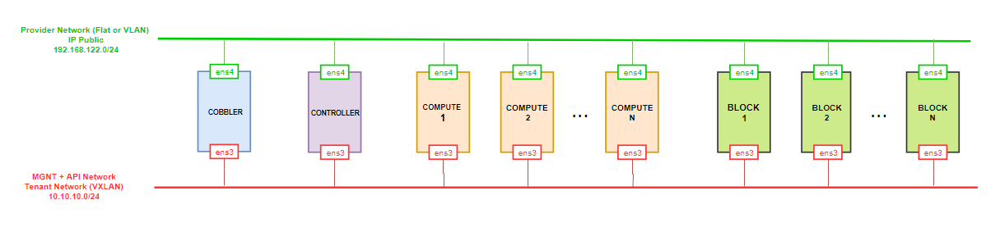
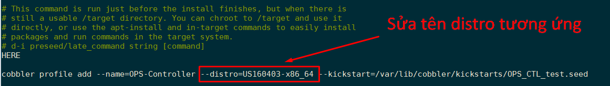
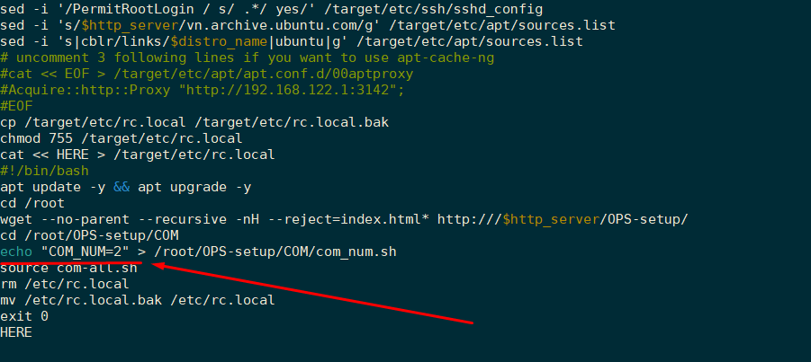
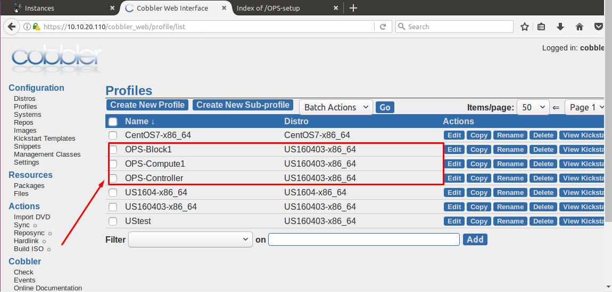
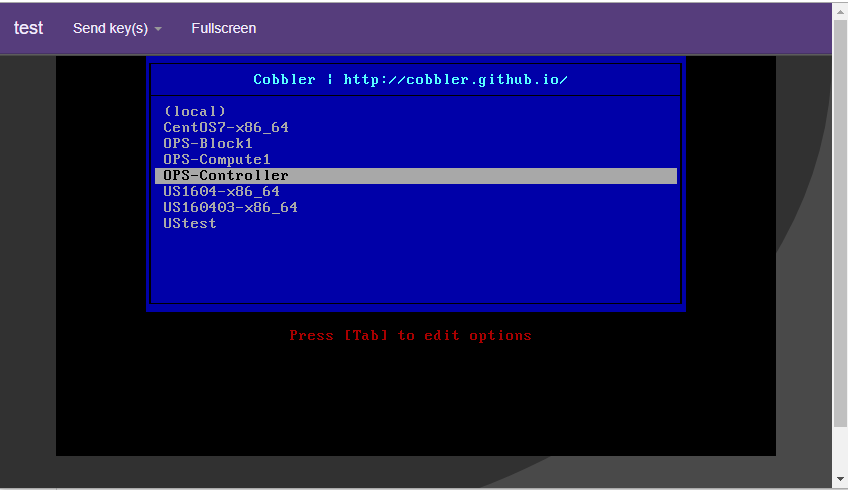
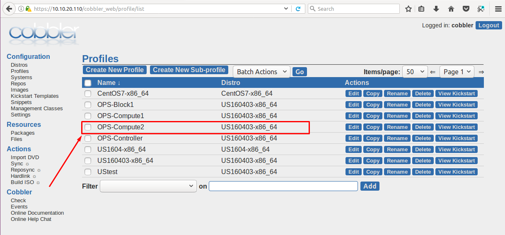
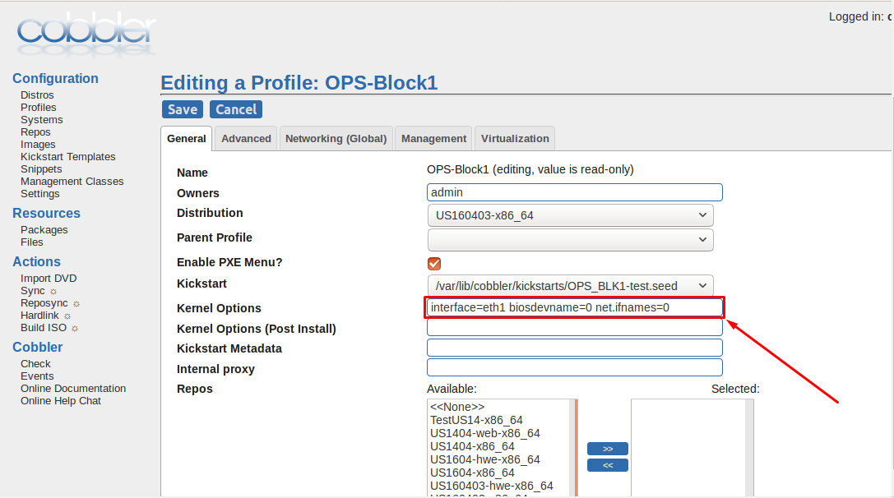

# TÍCH HỢP CÀI OPENSTACK VÀO COBBLER

### ***Mục lục***

[1. Mô hình](#1)

[2. Các bước cấu hình](#2)

- [2.1. Bước 1: Chuẩn bị script cài đặt Openstack (Pike)](#2.1)

- [2.2. Bước 2:  Cấu hình các script tạo profile tương ứng với các thành phần trong Openstack ](#2.2)

	- [2.2.1. CÁCH 1: Sử dụng file kickstart](#2.2.1)

	- [2.2.2. CÁCH 2: Sử dụng file preseed](#2.2.2)

	- [2.2.3. Cấu hình trên giao diện Cobbler](#2.2.3)

---

<a name = '1'></a>
# 1. Mô hình



- **Mục đích** : tích hợp các script cài đặt Openstack vào file kickstart build OS của Cobbler. Kết quả, khi chạy xong cài đặt hệ điều hành thì các máy client đã được cài sẵn như các node controller, compute, ... trong Openstack.

- Mô hình triển khai bài lab trên máy ảo KVM quản lý bởi Webvirtmgr. 

- Cobbler (trong mô hình này sử dụng Cobbler phiên bản 2.8.1) đã được cài đặt trên Centos 7 như đã trình bày trong các bài hướng dẫn trước.

- Các máy client còn lại để cài các node trong Openstack ban đầu chưa cài đặt OS.  

- Các máy có 2 card mạng thuộc 2 dải mạng như hình. 

- Thực hiện tích hợp script vào kickstart cài đặt Ubuntu server 16.04. 


<a name = '2'></a>
# 2.	Các bước cấu hình

<a name = '2.1'></a>
## Bước 1: Chuẩn bị script cài đặt Openstack (Pike)

- Ở đây có 2 script cài đặt Openstack sử dụng [Linux Bridge](../scripts/OPS-setup-LinuxBridge/) hoặc sử dụng [Open Vswitch](../scripts/OPS-setup-OVS/). Tùy theo mô hình Openstack mà bạn muốn triển khai để download script cài đặt thích hợp.

- Sau khi chọn mô hình triển khai như ý, thực hiện download thư mục con **OPS-setup** chứa file scripts cài đặt Openstack. Trên máy Cobbler, download cả thư mục `OPS-setup`. Sử dụng lệnh sau để download: 

	- Cài đặt theo mô hình sử dụng Linux Bridge: 

		```
		apt-get install subversion -y
		svn export https://github.com/hocchudong/ghichep-cobbler/trunk/scripts/OPS-setup-LinuxBridge/OPS-setup
		```

	- Cài đặt theo mô hình sử dụng Open Vswitch: 

		```
		apt-get install subversion -y
		svn export https://github.com/hocchudong/ghichep-cobbler/trunk/scripts/OPS-setup-OVS/OPS-setup
		```
		
- Sau khi có thư mục `OPS-setup/`, thực hiện di chuyển thư mục đó vào thư mục web root của Cobbler: 

	```
	cp -r OPS-setup/ /var/www/html/
	cd /var/www/html/
	chmod -R 755 OPS-setup/
	chown -R apache:apache OPS-setup/
	```

<a name = '2.2'></a>
## Bước 2: Cấu hình các script tạo profile tương ứng với các thành phần trong Openstack 

Có thể sử dụng file kickstart hoặc file preseed để cài đặt OS. Thực hiện một trong hai cách sau:

<a name = '2.2.1'></a>
### CÁCH 1: SỬ DỤNG FILE KICKSTART

- Ở đây, sử dụng các script trong thư mục tạo file kickstart [kickstart_OPS/](../scripts/kickstart_OPS) (Download cả thư mục này về sử dụng lệnh `svn` như phần trên) để thiết lập tạo các profile tương ứng cài cho các node Controller, các node compute và các node Block (Cinder).

	```
	svn export https://github.com/hocchudong/ghichep-cobbler/trunk/scripts/preseed_OPS/
	```

- File `config.sh` dùng để tùy chỉnh thích hợp với nhiều mô hình mạng khác nhau (thay thế địa chỉ IP của Cobbler phù hợp với mô hình của bạn)

	```
	# Var
	COBBLER_IP=192.168.122.110
	APT_CACHE_SERVER=192.168.122.1 #Dien IP cua cache-ng neu co
	PATH_OPSsetup="OPS-setup" #Thu muc chua cac file script cai dat OPS
	ROOT_PASS=welcome123	#password mac dinh cho user root cua cac con client cai OPS
	USER_NAME=ubuntu
	USER_PASS=welcome123
	REPO_PATH=http://192.168.122.110/cblr/links/US160403-x86_64/
	com_num=1
	blk_num=1
	```

	> Lưu ý: phần cấu hình REPO_PATH, trong bài này mình sử dụng distro tên US160403-x86_64 (import từ iso ubuntu server 16.04.3) nên đường dẫn tới repo là tới thư mục chứa các gói cần thiết cho quá trình cài đặt OS của distro tên US160403-x86_64. Trong mô hình của bạn sẽ sửa tên distro tương ứng cho phù hợp.

- Để tạo profile cài đặt node controller: thực hiện chạy file script `CTL_create_ks_profile.sh` (lưu ý: các file đuôi sh được set quyền 755 để thực thi được)
Để tạo profile cài đặt node compute: ta thực hiện sửa phần `com_num=n` trong file `config.sh` để tạo ra tương ứng cho node compute thứ n. 

- Tương tự tạo profile cài đặt node cinder thực hiện như trên (sửa phần `blk_num` để cho biết là cài node cinder thứ bao nhiêu). 

- Sau khi sửa file `config.sh`, thực hiện các lệnh sau: 

	```
	source CTL_ps_create_profile.sh
	source COM_ps_create_profile.sh
	source BLK_ps_create_profile.sh
	```


<a name = '2.2.2'></a>
###  CÁCH 2: SỬ DỤNG FILE PRESEED DÀNH CHO UBUNTU

- 	Cách này, sử dụng các script trong thư mục tạo file preseed [preseed_OPS/](../scripts/preseed_OPS) (Có thể download cả thư mục này về bằng cách sử dụng lệnh `svn` như phần trên, hoặc download từng file một sử dụng `wget`) để thiết lập tạo các profile tương ứng cài cho các node Controller, các node compute và các node Block (Cinder). 

- File `config.sh` dùng để tùy chỉnh thích hợp với nhiều mô hình mạng khác nhau (thay thế địa chỉ IP của Cobbler phù hợp với mô hình của bạn):

	```
	# Variable
	## IP address of COBBLER, APT_CACHE_SERVER and path for repo Ubuntu
	COBBLER_IP=192.168.122.1
	APT_CACHE_SERVER=192.168.122.1 #config this line if you have apt-cache-ng server
	REPO_FOLDER=/OPS-setup

	## Folder name contain scripts to install OpenStack
	PATH_OPSsetup="OPS-setup"

	## User name, user password and root password
	USER_NAME=ubuntu
	USER_PASS=welcome123
	ROOT_PASS=welcome123

	## Compute number and Block number
	com_num=1
	blk_num=1
	```

- Để tạo profile cài đặt node controller: thực hiện chạy file script `CTL_ps_create_profile.sh` (lưu ý: các file đuôi sh được set quyền 755 để thực thi được).
 
	> Lưu ý: Trong các scripts tạo file preseed, ở cuối có chạy lệnh thêm file preseed vừa tạo vào profile tương ứng. Chú ý tên distro, nếu bạn không làm theo hướng dẫn từ đầu của các phần ghi chép này, thì nhớ sửa tên distro tương ứng tại dòng cuối cùng các file trên. 

	

Để tạo profile cài đặt node compute: ta thực hiện sửa phần `com_num=n` trong file `config.sh` để tạo ra tương ứng cho node compute thứ n. 

- Tương tự tạo profile cài đặt node cinder thực hiện như trên (sửa phần `blk_num` để cho biết là cài node cinder thứ bao nhiêu). 

- Sau khi sửa file `config.sh`, thực hiện các lệnh sau: 

	```
	source CTL_ps_create.sh
	source COM_ps_create.sh
	source BLK_ps_create.sh
	```

- Download các file scripts dùng để chạy cài đặt Openstack sau khi cài đặt xong OS (và lưu vào thư mục chứa script dành cho preseed: `/var/lib/cobbler/scripts/`):

	```
	cd /var/lib/cobbler/scripts/
	wget https://raw.githubusercontent.com/hocchudong/ghichep-cobbler/master/scripts/preseed_OPS/CTL_script.sh 
	wget https://raw.githubusercontent.com/hocchudong/ghichep-cobbler/master/scripts/preseed_OPS/COM_script.sh
	wget https://raw.githubusercontent.com/hocchudong/ghichep-cobbler/master/scripts/preseed_OPS/BLK_script.sh
	```

	> Lưu ý, mỗi khi cài thêm các node Compute hoặc Block, cần sửa lại số thứ tự của node trong các file scripts cài đặt. Ví dụ, cài thêm cho node Compute thứ 2, chỉnh lại file `/var/lib/cobbler/scripts/COM_script.sh` như sau:

	

	Lưu lại file trước khi cài đặt node Compute thứ 2. 

<a name = '2.2.3'></a>
###  Kiểm tra trên giao diện sau khi thực hiện một trong hai cách trên

- Trên giao diện Cobbler ta có thêm 3 profile cài đặt Openstack 3 node: Controller, Compute1 và Block1 như sau: 

	

- Bật máy dùng để cài Controller lên ta thấy được giao diện như sau: 

	

- Ví dụ: Theo mặc định, như cấu hình trong file `config.sh` sau khi chạy các script tạo profile các node tương ứng lần đầu tiên ta sẽ có mô hình gồm 3 node: controller, compute 1, block 1.

- Bây giờ, để tạo cho profile cho node compute 2, ta sửa `com_num=2` trong file config.sh
Khi đó, chạy file script  `source COM_create_ks_profile.sh` để tạo profile cho node compute 2.

- Trên Cobbler đã có profile cho node compute 2 như sau:

	

- Sửa cấu hình cho kernel options các profile với Ubuntu 16.04 để tên card mạng về như cũ: Thêm **kernel options**: `biosdevname=0 net.ifnames=0` vào profile (sử dụng giao diện Cobbler) của các node Controller, Compute, và Block như sau:

	

- Sau khi lựa chọn cài đặt tương ứng, các máy sau khi cài OS được tích hợp script chạy cài đặt Openstack được cấu hình sẵn trong file `/etc/rc.local` đã sửa trong phần %post trong các file kickstart. 

<a name = '3'></a>
# 3. Tham khảo

[1] Script cài đặt Openstack Pike: https://github.com/doxuanson/Install-OpenStack/tree/master/Pike
