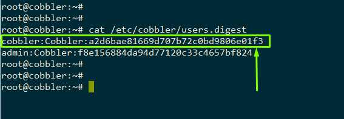

# MỘT SỐ GHI CHÉP VỀ COBBLER

<a name = '1'></a>
# 1. Thêm người dùng quản trị cobbler

- Mặc định, ban đầu Cobbler có người dùng quản trị là **cobbler** và mật khẩu là `cobbler`. Việc này không đảm bảo tính bảo mật của hệ thống. Nên tạo một người dùng mới cho hệ thống của bạn và dùng mật khẩu mà chỉ người quản trị mới biết được. Đồng thời xóa người dùng **cobbler** mặc định đi.

- Để thay thay đổi hoặc thêm người dùng khác cho Cobbler, ta sử dụng lệnh sau:

	```
	htdigest /etc/cobbler/users.digest "Cobbler" <user_name>
	```

	- Sau đó nhập password vào thiết lập mật khấu cho người dùng mới thêm. Sau khi thêm user mới, kiểm tra lại user mới đã có chưa trong file `/etc/cobbler/users.digest`
	
	- Khởi động lại cobbler:

		```
		systemctl restart cobblerd
		cobbler sync
		```
	
	- Đăng nhập lại bằng người dùng mới là xong.

- Xóa người dùng **cobbler** mặc định bằng cách comment hoặc xóa người dùng cobbler trong file `/etc/cobbler/users.digest`:

	

	Khởi động lại cobbler như trên là hoàn thành. Bây giờ trong hệ thống không còn người dùng **cobbler** mặc định nữa.

<a name = '2'></a>
# 2. Tổng hợp một số lỗi hay gặp trong quá trình cài đặt và cấu hình cobbler:

Link tham khảo: https://blog.leonshadow.com/763482/225.html
***updating...***


